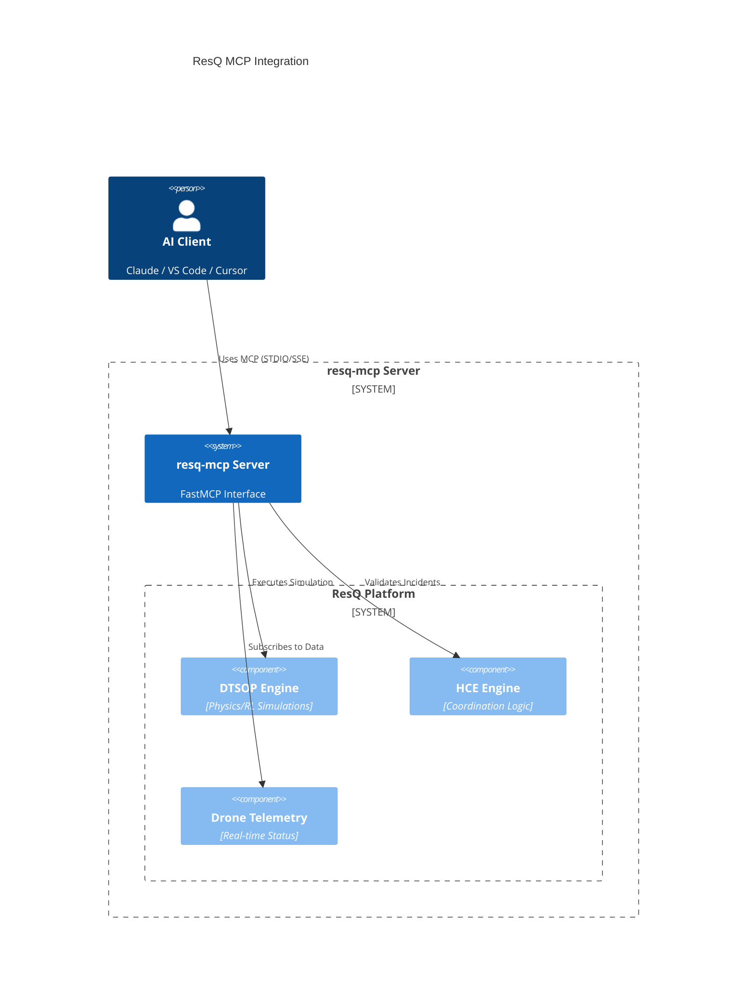

# ResQ MCP: Disaster Response Intelligence for AI

[](https://github.com/resq-software/mcp/actions)
[](https://pypi.org/project/resq-mcp/)
[](./LICENSE)

A production-ready Model Context Protocol (MCP) server that connects AI agents to the ResQ platform's robotics, physics simulations, and disaster telemetry.

---

## Capabilities

`resq-mcp` allows AI agents (Claude Desktop, VS Code Copilot, Cursor, etc.) to command and monitor disaster response operations through a secure, typed interface.

*   **Drone Fleet Command**: Real-time telemetry, sector scanning, and autonomous swarm deployment via the Hybrid Coordination Engine (HCE).
*   **Predictive Intelligence**: Probabilistic disaster forecasting and sector-level vulnerability mapping (PDIE).
*   **Digital Twin Simulations**: Physics-based RL optimization strategies for incident response (DTSOP).
*   **Safe-Mode Execution**: Built-in protection prevents destructive platform mutations in production environments by default.

---

## Quick Start

### For End Users (Claude Desktop)

Run the server instantly without manual cloning using `uvx`. Add this to your `claude_desktop_config.json`:

```json
{
  "mcpServers": {
    "resq": {
      "command": "uvx",
      "args": ["resq-mcp"],
      "env": {
        "RESQ_API_KEY": "your-prod-token",
        "RESQ_SAFE_MODE": "true"
      }
    }
  }
}
```

### For VS Code / Cursor

A pre-configured `.vscode/mcp.json` is included in this repo. To enable it:

```bash
# From the project root — starts the MCP server for VS Code / Cursor
code .
```

Or create `.vscode/mcp.json` manually in any workspace:

```json
{
  "servers": {
    "resq-mcp": {
      "type": "stdio",
      "command": "uv",
      "args": ["run", "resq-mcp"],
      "env": {
        "RESQ_API_KEY": "resq-dev-token",
        "RESQ_SAFE_MODE": "true"
      }
    }
  }
}
```

> **Tip**: For `uvx` (no local clone needed), replace `"command": "uv"` and `"args"` with `"command": "uvx"` and `"args": ["resq-mcp"]`.

### For Developers

Set up the local environment using [uv](https://github.com/astral-sh/uv):

```bash
git clone https://github.com/resq-software/mcp.git
cd mcp
uv sync
uv run resq-mcp
```

---

## Technical Architecture

The server acts as a secure intermediary, translating natural language requests into authenticated, platform-native service calls.



### Module Overview

```
src/resq_mcp/
├── server.py              # FastMCP init, lifespan, background tasks
├── resources.py           # @mcp.resource() endpoints (drones, sims)
├── prompts.py             # @mcp.prompt() templates (incident response)
├── core/                  # Cross-cutting: config, errors, security, telemetry, timeout
├── drone/                 # Drone feed: scan, swarm, deployment (models + service)
├── dtsop/                 # Digital Twin: simulation, optimization (models + service + tools)
├── hce/                   # Hybrid Coordination: incidents, missions (models + service + tools)
└── pdie/                  # Predictive Intelligence: vulnerability, alerts (models + service)
```

---

## Configuration

Control server behavior via environment variables or a `.env` file:

| Variable | Description | Default |
| :--- | :--- | :--- |
| `RESQ_API_KEY` | Platform authentication token | `resq-dev-token` |
| `RESQ_SAFE_MODE` | Prevents destructive mutations | `true` |
| `RESQ_PORT` | Port for SSE (networked) mode | `8000` |
| `RESQ_HOST` | Host to bind the SSE server | `0.0.0.0` |
| `RESQ_DEBUG` | Enable verbose logging | `false` |

---

## Security & Safety

**Safe Mode** is enabled by default (`RESQ_SAFE_MODE=true`). In this state, any tool that performs platform mutations (e.g., dispatching a drone swarm or starting a high-fidelity simulation) will raise a `FastMCPError`. This allows AI agents to plan missions safely without triggering real-world consequences. Disable this only when you are ready for autonomous execution.

---

## Tool Reference

### Mission Control (HCE)

| Tool | Description |
| :--- | :--- |
| `validate_incident` | Submit a confirmation or rejection for an incident report. Supports idempotent re-submission and conflict detection for opposing validations. |
| `update_mission_params` | Push authorized mission parameters to a specific drone for an approved strategy. Includes urgency escalation, conflict guards, and idempotent re-dispatch. |

### Simulation (DTSOP)

| Tool | Description |
| :--- | :--- |
| `run_simulation` | Queue a high-fidelity Digital Twin physics simulation (flood, wildfire, earthquake). Returns a job ID — subscribe to the resource URI for progress updates. |
| `get_deployment_strategy` | Generate an RL-optimized drone deployment and evacuation strategy for a confirmed incident or PDIE pre-alert. |

### Resources

| URI | Description |
| :--- | :--- |
| `resq://drones/active` | Real-time fleet status — drone types, battery levels, sector assignments. |
| `resq://simulations/{sim_id}` | Simulation progress and results. Supports SSE subscriptions for push updates on state transitions. |

### Prompts

| Prompt | Description |
| :--- | :--- |
| `incident_response_plan` | Structured crisis coordination template that guides an AI agent through situation analysis, asset allocation, and risk assessment for a given incident. |

---

## Example Workflows

### 1. Run a Flood Simulation

```
You:   "Run a flood simulation for Sector-3 with water level 4.2m"
Agent: Calls run_simulation → receives SIM-ABCD1234
       Subscribes to resq://simulations/SIM-ABCD1234
       Waits for status: completed
       Returns result URL and analysis
```

### 2. Full Incident Response

```
You:   "Validate incident INC-789 and deploy drones"
Agent: 1. Calls validate_incident(INC-789, confirmed=True)
       2. Calls get_deployment_strategy("INC-789")
       3. Reviews strategy with operator
       4. Calls update_mission_params("DRONE-Alpha", "STRAT-XYZ", urgent=True)
       5. Returns mission parameters and audit hash
```

### 3. Crisis Planning with Prompts

```
You:   Use the incident_response_plan prompt for INC-456
Agent: Receives structured template → calls tools → produces:
       - Situation Summary
       - Asset Allocation
       - Risk Assessment
```

---

## Contributing

We use `uv` for dependency management and `ruff` for linting.

1.  **Setup**: `uv sync` (installs all dependencies including dev group).
2.  **Test**: `uv run pytest`
3.  **Lint**: `uv run ruff check .`

Distributed under the Apache-2.0 License. Copyright 2026 ResQ.
